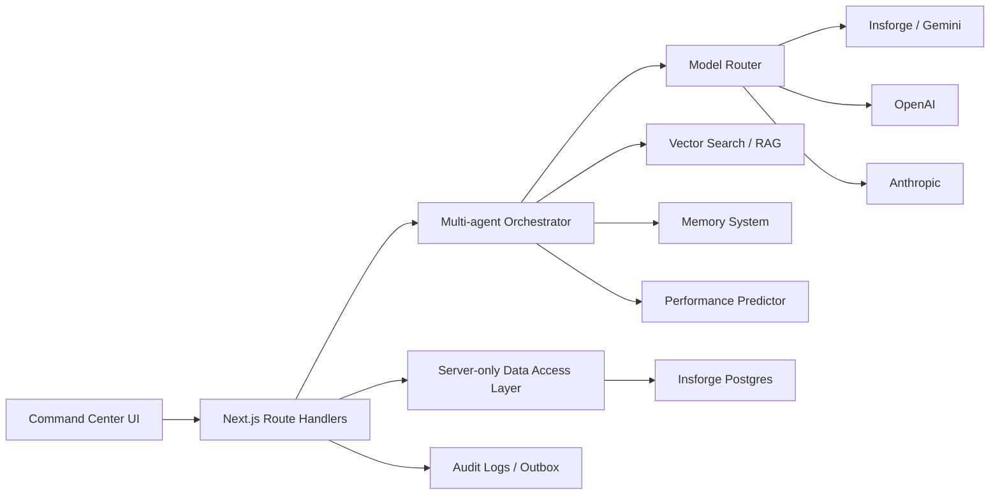
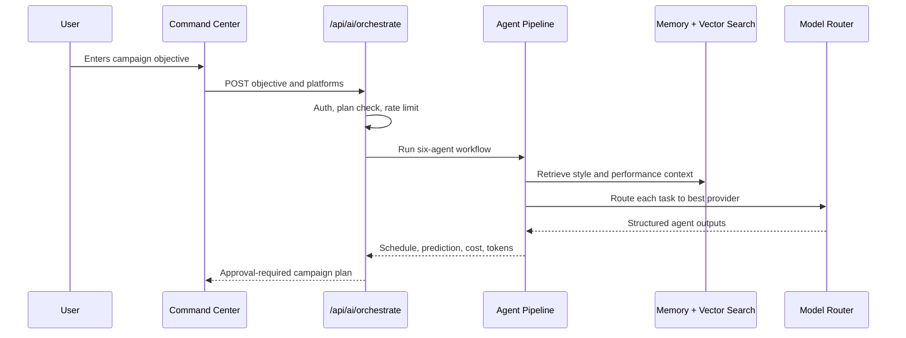

# SocialPilot OS V2 Architecture

SocialPilot V2 moves the product from an AI scheduler into an AI social media operating system.

## Key Improvements

- App Router pages stay server-first. Interactive UX lives in client islands.
- AI providers are abstracted behind `createModelRouter`.
- Agent orchestration is split into research, content, optimization, repurposing, scheduling, and analytics agents.
- RAG uses deterministic 64-dimensional embeddings locally and maps cleanly to `pgvector`.
- Memory is modeled as short-term, long-term, episodic, and semantic records.
- The database migration adds organizations, workspaces, roles, memories, embeddings, analytics, listening, approvals, comments, audit logs, webhooks, and outbox events.
- The command center demonstrates autonomous mode while preserving human approval before publishing.

## Request Flow

